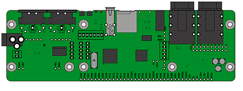
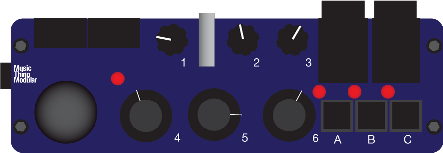
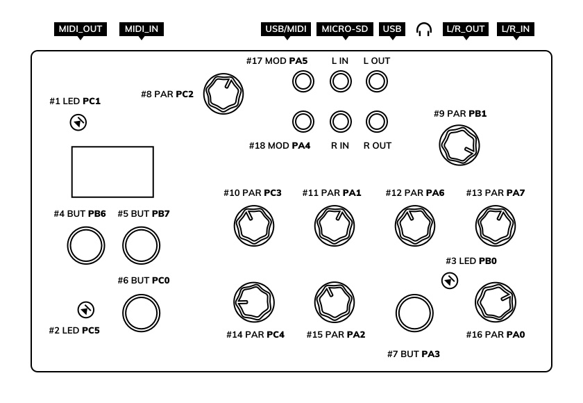
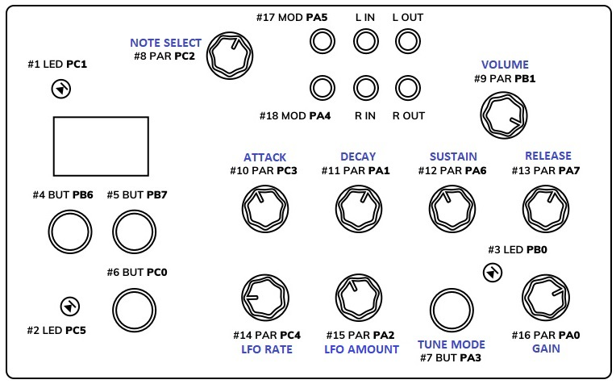
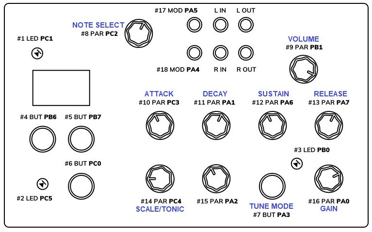

# axoloti
custom Axoloti patches  
Axoloti core board: http://www.axoloti.com/  
  
Music Thing Modular __AxoControl__ control board: https://www.musicthing.co.uk/retired/axocontrol.html  
  
Hohum Lab __Axoctrl__ control board: https://hohumlab.com/product/axoctrl/  
  

## Find out more about these patches:

### trice.axp  

subtractive monophonic synthesizer with controls MIDI mapped for Bass Station 2  
http://community.axoloti.com/t/axoloti-bass-patch/1627  
trice video demo:  

### AxoControl_synth1.axp  

Substractive synthesizer with parameters assigned to Music Thing Modular __AxoControl__ knobs and buttons. There is a total of 24 controllable parameters (using 6 knobs) divided into 4 pages. Button A - jump to next page, B - previous, C - gate (useful when there is no midi keyboard connected). Led 0 on = gate high, led A on = page 1, led B on = page 2, led C on = page 3, ABC leds off = page 4. Joystick up-down = modulation amount (100%/-100%), left-right = pitch bend  

  
Controls (Click to expand the list)

__Page 1 (oscillator)__  
knob1 - LFO1 amount (pitch)  
knob2 - tune (semitone steps)(useful when there is no midi keyboard connected)  
knob3 - waveform mix (saw/pulse)  
knob4 - manual pulse width control  
knob5 - LFO2 amount (PWM)  
knob6 - suboscillator level  

__Page 2 (low pass filter)__  
knob1 - resonance  
knob2 - envelope amount  
knob3 - LFO3 amount (cutoff)  
knob4 - cutoff  
knob5 - envelope attack time  
knob6 - envelope decay time  

__Page 3 (amp)__  
knob1 - distortion (disconnected - need to work out the levels)  
knob2 - envelope sustain level  
knob3 - volume  
knob4 - envelope attack time  
knob5 - envelope decay time  
knob6 - envelope release time  
  
__Page 4 (modulation)__  
knob1 - not connected  
knob2 - not connected  
knob3 - not connected  
knob4 - LFO1 frequency  
knob5 - LFO2 frequency  
knob6 - LFO3 frequency  

http://community.axoloti.com/t/simple-synthesizer-for-axocontrol/1928  

### AxoControl_Complex_Poly_V1.4.rar  

A synthesizer with architecture inspired by a Buchla Programable Complex Waveform Generator 259. It features two sine oscillators (with waveshapers), secondary osc is modulating the phase and/or amplitude of the primary osc, two ADSR envelope generators - one for each of the oscillators vcas. Secondary osc can be detuned and hard sync'ed to primary. 3-voice polyphony (75% DSP use). Modulation depth is linked to mod wheel (MIDI), all other parameters are assigned to Music Thing Modular __AxoControl__ knobs.  

  
Controls (Click to expand the list)

__Page 1 (left LED on):__

* Knob 2 - mod osc wavefold (sine - fold 100%)  
* Knob 4 - mod osc glide  
* Knob 5 - mod osc octave (+/-4 in relation to primary osc)  
* Knob 6 - primary osc shape (full ccw - saturated (square), middle sine, full cw - wavefold 100%)  

__Page 2 (middle LED on):__

* Knob 2 - mod envelope sustain level (0-100%)  
* Knob 4 - mod envelope attack time (2,41ms - 3,91s)  
* Knob 5 - mod envelope decay time (2,41ms - 3,91s)  
* Knob 6 - mod envelope release time (2,41ms - 3,91s)  

__Page 3 (right LED on):__

* Knob 2 - amplitude envelope sustain level (0-100%)  
* Knob 4 - amplitude envelope attack time (2,41ms - 3,91s)  
* Knob 5 - amplitude envelope decay time (2,41ms - 3,91s)  
* Knob 6 - amplitude envelope release time (2,41ms - 3,91s)  

No matter what page:

* Button A - decrease page number  
* Button B - increase page number  
* Button C - toggle for mod env control over primary osc wavefold depth  
* Knob 1 - mod osc tune (+/-7 semitones)  
* Knob 3 - master volume  
* Joystick left-right - mod osc pitch bend (+/- 3 semitones)  
* Joystick button - toggle hard sync mod osc to primary (LED on, off)  

http://community.axoloti.com/t/259-inspired-polyphonic-synthesizer/2837/9  
Sound demo: https://soundcloud.com/odro/axoloti-pm-synth

### Axoctrl_Pages_V1.0.axp

A patch dedicated to make use of the knobs and screen availble in Hohum Lab __Axoctrl__ to control multiple pages of parameters (and display them). Same idea as the one used in the [AxoControl_Complex_Poly](https://github.com/maceq687/axoloti/edit/master/README.md#axocontrol_complex_poly_v14rar), but this time the presence of the screen in the Axoctrl gives an opportunity to display currently controlled parameter's names and values. I've decided to use bars to represent the values but it is possible to easily rebuild the patch so the actual numeric values (0-64) will be displayed.  
Knobs in the middle row (10-13) are assigned to control total of 16 parameters spread over 4 pages (using demux). Buttons 5 and 4 are used to increase and decrease page number. After page change its name is being displayed briefly in the top row of the display. Button 6 toggles between display modes - parameters or oscilloscope.  
http://community.axoloti.com/t/multiple-pages-of-parameters-for-axoctrl/6572  
Video demo of the patch being used in my Axoctrl_Complex_Poly patch:  

### Axoctrl_Complex_Poly_V1.6.rar

My [Complex_Poly](https://github.com/maceq687/axoloti/edit/master/README.md#axocontrol_complex_poly_v14rar) synthesizer redone for the Hohum Lab __Axoctrl__. I've dropped the option of pitch bend for the secondary oscillator - AxoControl had spring loaded joystick that was used for that. 3-voice polyphony (75% DSP used). Modulation depth is linked to mod wheel (MIDI).  

  
Controls (Click to expand the list)

Page 1 [OSCILLATORS]:

* Knob 10 - [2slew] - modulation oscillator slew
* Knob 11 - [2oct] - modulation oscillator octave (+/-4 in relation to primary osc)
* Knob 12 - [2fold] - modulation oscillator wavefold (sine - fold 100%)
* Knob 13 - [1shp] - primary oscillator shape (full ccw - saturated (square), middle sine, full cw - wavefold 100%)

Page 2 [MOD_ENV]:

* Knob 10 - [MODa] - modulation envelope attack time (2,41ms - 3,91s)
* Knob 11 - [MODd] - modulation envelope decay time (2,41ms - 3,91s)
* Knob 12 - [MODs] - modulation envelope sustain level (0-100%)
* Knob 13 - [MODr] - modulation envelope release time (2,41ms - 3,91s)

Page 3 [AMP_ENV]:

* Knob 10 - [AMPa] - modulation envelope attack time (2,41ms - 3,91s)
* Knob 11 - [AMPd] - modulation envelope decay time (2,41ms - 3,91s)
* Knob 12 - [AMPs] - modulation envelope sustain level (0-100%)
* Knob 13 - [AMPr] - modulation envelope release time (2,41ms - 3,91s)

Button 4 - decrease page number  
Button 5 - increase page number  
Button 6 - short press toggles display modes - parameters or oscilloscope  
Button 6 - long press toggles modulation envelope control over primary oscillator wavefold depth (LED 2)  
Button 7 - toggles hard sync of modulation oscillator to primary oscillator (LED 3)  
Knob 9 - master volume  
Knob 14 - modulation oscillator tune (+/-7 semitones)  
Knob 15 - modulation depth (same control as mod wheel)  
LED 1 - indicates if either voice gate is high  

http://community.axoloti.com/t/259-inspired-polyphonic-synthesizer/2837/39

### harmonizer.axp

My take on emulating EML Poly-Box. It's a harmonizer that is capable of pitch shifting the incoming audio according to the MIDI note input. Designed to work with Hohum Lab __Axoctrl__ knob/button layout. 4 voice polyphony (77% DSP used).  
  
It is designed to work in a similar fashion to how the Poly-Box worked:

* input continues tone (drone) in to the axoloti left audio in
* press tune button (button 7) to switch to tune mode
* set the audio in pitch (knob 8) and gain (knob 16) - you will hear pilot tone and the note number will be visible on display, scope will present audio in signal
* press tune button to switch back to play mode
* set envelope parameters (knobs 10-13)
* play on your keyboard

There is an additional delayed pitch LFO (per voice, with retrigger on note on):

* LFO rate (knob 14)
* LFO amount (knob 15)

There is also a stereo voice spread (another delayed LFO (per voice)).
LED 1 lights up on voice activity  
http://community.axoloti.com/t/eml-poly-box-emulation/494/2  
Harmonizer video demos:  
  

### chord_box.axp

Another harmonizer but this one is capable of pitch shifting the incoming audio into a 7th chord according to the MIDI note input. The chord is built on the played note. You can select scale (major/minor) and tonic. This is another take on my previous project Poly-Box emulation. It is designed to work with Hohum Lab __Axoctrl__ knob/button layout. Monopohnic note input (70% DSP used).  
  
How to make it work:

* feed continues tone (drone) in to the axoloti left audio in
* press tune button (button 7) to switch to tune mode
* set the audio in pitch (knob 8) and gain (knob 16) - you will hear pilot tone and the note number will be visible on display, scope will present audio in signal
* press tune button to switch back to play mode
* set envelope parameters (knobs 10-13)
* play on your keyboard

http://community.axoloti.com/t/chord-box-harmonizer/7928
